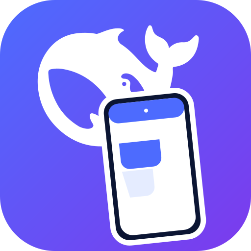

# DSH Mobile —— 稳定、私密的 DSH 手机访问套件

<p align="center">
  
</p>

本项目专门解决 **DeepSeek Harness（DSH）手机访问的连接稳定性与私密性**：手机不
依赖第三方内网穿透服务，而是通过你自己 VPS 上的 cloud-relay，走自己域名的 HTTPS
隧道回到 Mac/工作站上的 DSH。手机侧在此基础上做了完整的体验打磨——操作流程、
会话分组、手势、输入框、系统通知栏等。

> 前提：你需要**一台自己的 VPS**。如果 VPS 在中国大陆，域名需要完成 ICP 备案；
> 使用海外 VPS 时也需要一个自己的域名来签发 TLS 证书。整条链路完全自托管，
> 服务端与手机之间的唯一凭证是自生成的手机口令和隧道令牌。

## 与 Tailscale 类项目不冲突

Tailscale/ZeroTier 等解决的是「设备之间如何安全组网、相互可达」。本项目解决的是
「DSH 在手机上的可用性」：

- 手机侧操作流程优化：配置页、配对、断线自动重连、会话抽屉、二级页返回；
- 移动端交互打磨：中间区域横滑拉出会话列表、分组折叠与预览、Enter 换行、
  发送/停止按钮分离、SafeArea 状态栏避让；
- 通知栏：审批/提问/任务完成进入 Android 系统通知栏（App 进程存活时）；
- 入口安全：手机只连自己的公网域名，口令只在首次导航出现并被 302 剥除。

两者可以叠加使用：Tailscale 负责把多台设备组进一个私有网，本项目则提供手机到
DSH 的专属入口与移动端体验。

## 完整一套包含什么

| 目录 | 作用 |
| --- | --- |
| `deepseek-harness/` | DSH 本体源码（含移动 Web 壳 `/m`、移动前端 `apps/mobile` 与 `packages/client/mobile`） |
| `dsh-mobile/` | Flutter 原生壳 App：配置、WebView、自动重连、凭据安全存储、系统通知桥 |
| `dsh-relay/` | Go 中继：`dsh-cloud-relay`（VPS 公网入口）+ `dsh-local-relay`（Mac 出站隧道）+ Docker/Caddy 部署 |
| `dsh-mobile-server-plugin/` | 把移动 Web `dist` 挂载到 `dsh web` 的 `/m` 前缀的 Cordis 插件 |
| `scripts/` | 移动壳健康检查与断线自愈长跑脚本 |

## 架构

```
手机 App（dsh-mobile）
  └─ WebView → https://relay.example.com/m/?pass=<手机口令>
                    │  校验通过 → Set-Cookie → 302 剥除 ?pass=
                    ▼
VPS：dsh-cloud-relay（Caddy TLS，仅 443）
  └─ 仅接受持有隧道令牌的 local-relay 连接（wss://…/tunnel?token=…）
                    ▼
Mac/工作站：dsh-local-relay（常驻出站隧道）
  └─ 重写 Host → http://127.0.0.1:3080
                    ▼
DSH Web（dsh web，桌面 / + 移动 /m）
```

## 快速开始

1. **VPS**：按 [`dsh-relay/DEPLOY.md`](dsh-relay/DEPLOY.md) 部署 cloud-relay，
   生成 `TUNNEL_TOKEN`（给 Mac）和 `PHONE_PASS`（给手机），配置 Caddy TLS。
2. **DSH 本机**：安装/启动 local-relay：
   ```bash
   dsh-local-relay --cloud wss://relay.example.com/tunnel?token=<TUNNEL_TOKEN>      --local http://127.0.0.1:3080
   ```
   并用 [`dsh-mobile-server-plugin/README.md`](dsh-mobile-server-plugin/README.md)
   把 `/m` 挂到 `dsh web`。
3. **移动前端**：
   ```bash
   cd deepseek-harness
   pnpm install
   pnpm --filter @deepseek-ai/dsh-mobile-frontend build
   ```
4. **手机 App**：按 [`dsh-mobile/README.md`](dsh-mobile/README.md) 构建并安装，
   配置服务器 `https://relay.example.com` 与手机口令。

## 安全模型

- 手机侧唯一凭证是 `PHONE_PASS`，支持 `X-DC-Pass` 头、`?pass=` 查询参数、
  HttpOnly cookie 三种形态；首次配对后 302 剥掉查询参数。
- Mac 侧唯一凭证是 `TUNNEL_TOKEN`，cloud-relay 用常数时间比较校验。
- 公网入口强制 HTTPS；App 只允许同源导航，凭据保存在 Android Keystore。
- 详见 [`dsh-relay/DEPLOY.md`](dsh-relay/DEPLOY.md) 与
  [`dsh-mobile/README.md`](dsh-mobile/README.md) 的安全说明。

## 已知边界

- 系统通知依赖 App 进程存活；App 被系统或用户强制杀死后，WebView 内 JS 停止，
  无法产生新通知（这是当前 WebView 架构的硬边界）。
- 口令会短暂出现在首次导航 URL 中，随后由服务端 302 剥除；一次性令牌可作
  后续增强。

## License

[MIT](LICENSE)。其中 `deepseek-harness/` 保留其自身的 MIT 版权声明。
